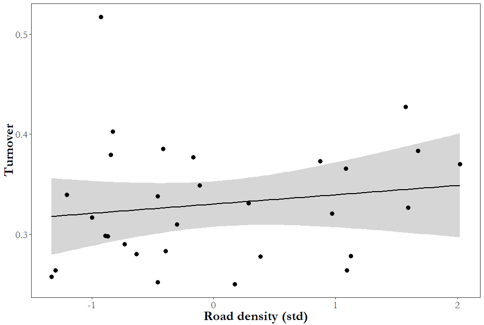
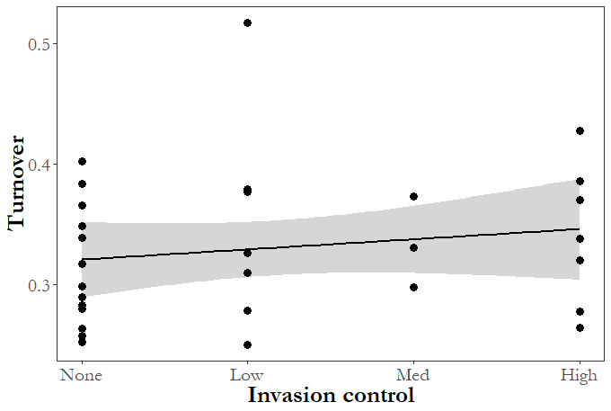

# Garry oak meadow data exploration

## *Conservation Science and Practice, in revision*

NAS 09-05-2019

### Script description --

Create exploratory plots of response variables and predictors of interest in Garry oak meadow management research. Data was collected in the spring and summer of both 2007 and 2017, by Dr. Joseph Bennett (2007) and by Dr. Nancy Shackelford (2017) on Saanich Penninsula  in British Columbia. See repository README (currently in prep) and publication (currently in revision) for further details.

```
### Load packages
library(tidyverse)
library(gridExtra)
library(extrafont)

##### Data file and cleaning
### Data for site-level results
data <- read.csv("Simple_data.csv")
colnames(data)[1] <- "Site" 
data <- data %>%
  mutate(AreaS = (Area_07 - mean(Area_07)) / sd(Area_07)) # Standardize area
rownames(data) <- data$Site

### Data for group-level results (used in functional redundancy only)
data_s <- read.csv('For_analysis_S2.csv')
data_s[is.na(data_s)] <- 0
data_s$Invasive <- factor(data_s$Invasive, 
                          levels = c("None", "Low", "Med", "High")) # Correct ranking
data_s$Invasive <- as.numeric(data_s$Invasive) # To ordinal
data_s$Grp <- as.factor(data_s$Grp)
data_s <- data_s %>%
  filter(FR.09 > 0) %>%
  mutate(FRC = (FR.17 - FR.09) / FR.09) %>%
  mutate(AreaS = (Area.2007 - mean(Area.2007)) / sd(Area.2007),
         ConnS = (Conn - mean(Conn)) / sd(Conn),
         RdS = (RdDens.1KM - mean(RdDens.1KM)) / sd(RdDens.1KM)) # Drop empty functional groups and standardize predictors
```

```
#### Area lost plots
### Histogram
data$myfill <- data$AreaC
data$myfill[data$myfill > 0.25 & data$myfill <= 0.3] <- 7
data$myfill[data$myfill > 0.2 & data$myfill <= 0.25] <- 6
data$myfill[data$myfill > 0.15 & data$myfill <= 0.2] <- 5
data$myfill[data$myfill > 0.1 & data$myfill <= 0.15] <- 4
data$myfill[data$myfill > 0.05 & data$myfill <= 0.1] <- 3
data$myfill[data$myfill >= 0 & data$myfill <= 0.05] <- 2

ggplot(data) +
  geom_histogram(aes(x = AreaC, fill = factor(myfill)), 
                 breaks = seq(0,0.3,0.05)) +
  xlab("Proportional area lost") +
  scale_fill_brewer(palette = "Greens") +
  theme_bw() +
  theme(axis.text.y = element_text(size = 16,
                                   family = "Garamond"),
        axis.title.y = element_blank()) +
  theme(axis.text.x = element_text(size = 16,
                                   family = "Garamond"),
        axis.title.x = element_text(size = 20, face = "bold",
                                    family = "Garamond")) +
  theme(panel.grid.major = element_blank(), 
        panel.grid.minor = element_blank(), 
        panel.background = element_blank()) +
  theme(legend.position = "none")
```


```
### By predictors
# 2007 area
ggplot(data) +
  geom_smooth(aes(y = AreaC, x = Area_07),
              method = 'lm',
              formula = y ~ x) +
  geom_point(aes(y = AreaC, x = Area_07),
             size = 3) +
  ylab("Proportional area lost") +
  xlab("2007 Patch Area") +
  theme_bw() +
  theme(axis.text.y = element_text(size = 16,
                                   family = "Garamond"),
        axis.title.y = element_text(size = 20, face = "bold",
                                    family = "Garamond")) +
  theme(axis.text.x = element_text(size = 16,
                                   family = "Garamond"),
        axis.title.x = element_text(size = 20, face = "bold",
                                    family = "Garamond")) +
  theme(panel.grid.major = element_blank(), 
        panel.grid.minor = element_blank(), 
        panel.background = element_blank()) 
```


```
# Roads (standardized value)
ggplot(data) +
  geom_smooth(aes(y = AreaC, x = RdS),
              method = 'lm',
              formula = y ~ x) +
  geom_point(aes(y = AreaC, x = RdS),
             size = 3) +
  ylab("Proportional area lost") +
  xlab("Road density (std)") +
  theme_bw() +
  theme(axis.text.y = element_text(size = 16,
                                   family = "Garamond"),
        axis.title.y = element_text(size = 20, face = "bold",
                                    family = "Garamond")) +
  theme(axis.text.x = element_text(size = 16,
                                   family = "Garamond"),
        axis.title.x = element_text(size = 20, face = "bold",
                                    family = "Garamond")) +
  theme(panel.grid.major = element_blank(), 
        panel.grid.minor = element_blank(), 
        panel.background = element_blank())
```


```
# Connectivity (standardized value)
ggplot(data) +
  geom_smooth(aes(y = AreaC, x = ConnS),
              method = 'lm',
              formula = y ~ x) +
  geom_point(aes(y = AreaC, x = ConnS),
             size = 3) +
  ylab("Proportional area lost") +
  xlab("Connectivity (std)") +
  theme_bw() +
  theme(axis.text.y = element_text(size = 16,
                                   family = "Garamond"),
        axis.title.y = element_text(size = 20, face = "bold",
                                    family = "Garamond")) +
  theme(axis.text.x = element_text(size = 16,
                                   family = "Garamond"),
        axis.title.x = element_text(size = 20, face = "bold",
                                    family = "Garamond")) +
  theme(panel.grid.major = element_blank(), 
        panel.grid.minor = element_blank(), 
        panel.background = element_blank())
```


```
# Management intensity (ordinal)
ggplot(data) +
  geom_smooth(aes(y = AreaC, x = Inv_C),
              method = 'lm',
              formula = y ~ x) +
  geom_point(aes(y = AreaC, x = Inv_C),
             size = 3) +
  ylab("Proportional area lost") +
  xlab("Invasion control") +
  scale_x_continuous(breaks = c(0, 1, 2, 3), 
                     labels = c("None", "Low", "Med", "High")) +
  theme_bw() +
  theme(axis.text.y = element_text(size = 16,
                                   family = "Garamond"),
        axis.title.y = element_text(size = 20, face = "bold",
                                    family = "Garamond")) +
  theme(axis.text.x = element_text(size = 16,
                                   family = "Garamond"),
        axis.title.x = element_text(size = 20, face = "bold",
                                    family = "Garamond")) +
  theme(panel.grid.major = element_blank(), 
        panel.grid.minor = element_blank(), 
        panel.background = element_blank())
```


```
#### Species richness plots
### Histogram of 2017 total
ggplot(data) +
  geom_bar(aes(x = Site, y = Rich_17), fill = "red4",
           stat = "identity") +
  geom_bar(aes(x = Site, y = Nat_17), fill = "royalblue",
           stat = "identity") +
  ylab("Species richness (2017)") +
  theme_bw() +
  theme(axis.text.y = element_text(size = 16,
                                   family = "Garamond"),
        axis.title.y = element_text(size = 20, face = "bold",
                                    family = "Garamond")) +
  theme(axis.text.x = element_text(size = 16, hjust = 1, angle = 45,
                                   family = "Garamond"),
        axis.title.x = element_blank()) +
  theme(panel.grid.major = element_blank(), 
        panel.grid.minor = element_blank(), 
        panel.background = element_blank())
```


```
### Changes by predictors
# Area lost
p1 <- ggplot(data) +
  geom_smooth(aes(y = RichC, x = AreaC),
              method = 'lm',
              formula = y ~ x,
              color = "black") +
  geom_point(aes(y = RichC, x = AreaC),
             size = 3) +
  xlab("Proportional area lost") +
  ylab("Change in richness") +
  theme_bw() +
  theme(axis.text.y = element_text(size = 16,
                                   family = "Garamond"),
        axis.title.y = element_text(size = 20, face = "bold",
                                    family = "Garamond")) +
  theme(axis.text.x = element_text(size = 16,
                                   family = "Garamond"),
        axis.title.x = element_text(size = 20, face = "bold",
                                    family = "Garamond")) +
  theme(panel.grid.major = element_blank(), 
        panel.grid.minor = element_blank(), 
        panel.background = element_blank())

p2 <- ggplot(data) +
  geom_smooth(aes(y = NatC, x = AreaC),
              method = 'lm',
              formula = y ~ x,
              color = "royalblue") +
  geom_point(aes(y = NatC, x = AreaC),
             size = 3, color = "royalblue") +
  xlab("Proportional area lost") +
  ylab("Change in native richness") +
  theme_bw() +
  theme(axis.text.y = element_text(size = 16,
                                   family = "Garamond"),
        axis.title.y = element_text(size = 20, face = "bold",
                                    family = "Garamond")) +
  theme(axis.text.x = element_text(size = 16,
                                   family = "Garamond"),
        axis.title.x = element_text(size = 20, face = "bold",
                                    family = "Garamond")) +
  theme(panel.grid.major = element_blank(), 
        panel.grid.minor = element_blank(), 
        panel.background = element_blank())

p3 <- ggplot(data) +
  geom_smooth(aes(y = NISC, x = AreaC),
              method = 'lm',
              formula = y ~ x,
              color = "red4") +
  geom_point(aes(y = NISC, x = AreaC),
             size = 3, color = "red4") +
  xlab("Proportional area lost") +
  ylab("Change in NIS richness") +
  theme_bw() +
  theme(axis.text.y = element_text(size = 16,
                                   family = "Garamond"),
        axis.title.y = element_text(size = 20, face = "bold",
                                    family = "Garamond")) +
  theme(axis.text.x = element_text(size = 16,
                                   family = "Garamond"),
        axis.title.x = element_text(size = 20, face = "bold",
                                    family = "Garamond")) +
  theme(panel.grid.major = element_blank(), 
        panel.grid.minor = element_blank(), 
        panel.background = element_blank())

grid.arrange(p1, p2, p3, ncol = 3)
```


```
# Roads (standardized value)
p1 <- ggplot(data) +
  geom_smooth(aes(y = RichC, x = RdS),
              method = 'lm',
              formula = y ~ x,
              color = "black") +
  geom_point(aes(y = RichC, x = RdS),
             size = 3) +
  xlab("Road density (std)") +
  ylab("Change in richness") +
  theme_bw() +
  theme(axis.text.y = element_text(size = 16,
                                   family = "Garamond"),
        axis.title.y = element_text(size = 20, face = "bold",
                                    family = "Garamond")) +
  theme(axis.text.x = element_text(size = 16,
                                   family = "Garamond"),
        axis.title.x = element_text(size = 20, face = "bold",
                                    family = "Garamond")) +
  theme(panel.grid.major = element_blank(), 
        panel.grid.minor = element_blank(), 
        panel.background = element_blank())

p2 <- ggplot(data) +
  geom_smooth(aes(y = NatC, x = RdS),
              method = 'lm',
              formula = y ~ x,
              color = "royalblue") +
  geom_point(aes(y = NatC, x = RdS),
             size = 3, color = "royalblue") +
  xlab("Road density (std)") +
  ylab("Change in native richness") +
  theme_bw() +
  theme(axis.text.y = element_text(size = 16,
                                   family = "Garamond"),
        axis.title.y = element_text(size = 20, face = "bold",
                                    family = "Garamond")) +
  theme(axis.text.x = element_text(size = 16,
                                   family = "Garamond"),
        axis.title.x = element_text(size = 20, face = "bold",
                                    family = "Garamond")) +
  theme(panel.grid.major = element_blank(), 
        panel.grid.minor = element_blank(), 
        panel.background = element_blank())

p3 <- ggplot(data) +
  geom_smooth(aes(y = NISC, x = RdS),
              method = 'lm',
              formula = y ~ x,
              color = "red4") +
  geom_point(aes(y = NISC, x = RdS),
             size = 3, color = "red4") +
  xlab("Road density (std)") +
  ylab("Change in NIS richness") +
  theme_bw() +
  theme(axis.text.y = element_text(size = 16,
                                   family = "Garamond"),
        axis.title.y = element_text(size = 20, face = "bold",
                                    family = "Garamond")) +
  theme(axis.text.x = element_text(size = 16,
                                   family = "Garamond"),
        axis.title.x = element_text(size = 20, face = "bold",
                                    family = "Garamond")) +
  theme(panel.grid.major = element_blank(), 
        panel.grid.minor = element_blank(), 
        panel.background = element_blank())

grid.arrange(p1, p2, p3, ncol = 3)
```


```
# Connectivity (standardized value)
p1 <- ggplot(data) +
  geom_smooth(aes(y = RichC, x = ConnS),
              method = 'lm',
              formula = y ~ x,
              color = "black") +
  geom_point(aes(y = RichC, x = ConnS),
             size = 3) +
  xlab("Connectivity (std)") +
  ylab("Change in richness") +
  theme_bw() +
  theme(axis.text.y = element_text(size = 16,
                                   family = "Garamond"),
        axis.title.y = element_text(size = 20, face = "bold",
                                    family = "Garamond")) +
  theme(axis.text.x = element_text(size = 16,
                                   family = "Garamond"),
        axis.title.x = element_text(size = 20, face = "bold",
                                    family = "Garamond")) +
  theme(panel.grid.major = element_blank(), 
        panel.grid.minor = element_blank(), 
        panel.background = element_blank())

p2 <- ggplot(data) +
  geom_smooth(aes(y = NatC, x = ConnS),
              method = 'lm',
              formula = y ~ x,
              color = "royalblue") +
  geom_point(aes(y = NatC, x = ConnS),
             size = 3, color = "royalblue") +
  xlab("Connectivity (std)") +
  ylab("Change in native richness") +
  theme_bw() +
  theme(axis.text.y = element_text(size = 16,
                                   family = "Garamond"),
        axis.title.y = element_text(size = 20, face = "bold",
                                    family = "Garamond")) +
  theme(axis.text.x = element_text(size = 16,
                                   family = "Garamond"),
        axis.title.x = element_text(size = 20, face = "bold",
                                    family = "Garamond")) +
  theme(panel.grid.major = element_blank(), 
        panel.grid.minor = element_blank(), 
        panel.background = element_blank())

p3 <- ggplot(data) +
  geom_smooth(aes(y = NISC, x = ConnS),
              method = 'lm',
              formula = y ~ x,
              color = "red4") +
  geom_point(aes(y = NISC, x = ConnS),
             size = 3, color = "red4") +
  xlab("Connectivity (std)") +
  ylab("Change in NIS richness") +
  theme_bw() +
  theme(axis.text.y = element_text(size = 16,
                                   family = "Garamond"),
        axis.title.y = element_text(size = 20, face = "bold",
                                    family = "Garamond")) +
  theme(axis.text.x = element_text(size = 16,
                                   family = "Garamond"),
        axis.title.x = element_text(size = 20, face = "bold",
                                    family = "Garamond")) +
  theme(panel.grid.major = element_blank(), 
        panel.grid.minor = element_blank(), 
        panel.background = element_blank())

grid.arrange(p1, p2, p3, ncol = 3)
```


```
# Management intensity (ordinal)
p1 <- ggplot(data) +
  geom_smooth(aes(y = RichC, x = Inv_C),
              method = 'lm',
              formula = y ~ x,
              color = "black") +
  geom_point(aes(y = RichC, x = Inv_C),
             size = 3) +
  xlab("Invasion control") +
  scale_x_continuous(breaks = c(0, 1, 2, 3), 
                     labels = c("None", "Low", "Med", "High")) +
  ylab("Change in richness") +
  theme_bw() +
  theme(axis.text.y = element_text(size = 16,
                                   family = "Garamond"),
        axis.title.y = element_text(size = 20, face = "bold",
                                    family = "Garamond")) +
  theme(axis.text.x = element_text(size = 16,
                                   family = "Garamond"),
        axis.title.x = element_text(size = 20, face = "bold",
                                    family = "Garamond")) +
  theme(panel.grid.major = element_blank(), 
        panel.grid.minor = element_blank(), 
        panel.background = element_blank())

p2 <- ggplot(data) +
  geom_smooth(aes(y = NatC, x = Inv_C),
              method = 'lm',
              formula = y ~ x,
              color = "royalblue") +
  geom_point(aes(y = NatC, x = Inv_C),
             size = 3, color = "royalblue") +
  xlab("Invasion control") +
  scale_x_continuous(breaks = c(0, 1, 2, 3), 
                     labels = c("None", "Low", "Med", "High")) +
  ylab("Change in native richness") +
  theme_bw() +
  theme(axis.text.y = element_text(size = 16,
                                   family = "Garamond"),
        axis.title.y = element_text(size = 20, face = "bold",
                                    family = "Garamond")) +
  theme(axis.text.x = element_text(size = 16,
                                   family = "Garamond"),
        axis.title.x = element_text(size = 20, face = "bold",
                                    family = "Garamond")) +
  theme(panel.grid.major = element_blank(), 
        panel.grid.minor = element_blank(), 
        panel.background = element_blank())

p3 <- ggplot(data) +
  geom_smooth(aes(y = NISC, x = Inv_C),
              method = 'lm',
              formula = y ~ x,
              color = "red4") +
  geom_point(aes(y = NISC, x = Inv_C),
             size = 3, color = "red4") +
  xlab("Invasion control") +
  scale_x_continuous(breaks = c(0, 1, 2, 3), 
                     labels = c("None", "Low", "Med", "High")) +
  ylab("Change in NIS richness") +
  theme_bw() +
  theme(axis.text.y = element_text(size = 16,
                                   family = "Garamond"),
        axis.title.y = element_text(size = 20, face = "bold",
                                    family = "Garamond")) +
  theme(axis.text.x = element_text(size = 16,
                                   family = "Garamond"),
        axis.title.x = element_text(size = 20, face = "bold",
                                    family = "Garamond")) +
  theme(panel.grid.major = element_blank(), 
        panel.grid.minor = element_blank(), 
        panel.background = element_blank())

grid.arrange(p1, p2, p3, ncol = 3)
```


```
#### Turnover plots
### Histogram
ggplot(data) +
  geom_histogram(aes(x = Turnover),
                 binwidth = 0.03) +
  xlab("Turnover") +
  ylab("Count") +
  theme_bw() +
  theme(axis.text.x = element_text(size = 16,
                                   family = "Garamond"),
        axis.title.x = element_text(size = 20, face = "bold",
                                    family = "Garamond")) +
  theme(axis.text.y = element_text(size = 16, hjust = 1, angle = 45,
                                   family = "Garamond"),
        axis.title.y = element_text(size = 20, face = "bold",
                                    family = "Garamond")) +
  theme(panel.grid.major = element_blank(), 
        panel.grid.minor = element_blank(), 
        panel.background = element_blank())
```


```
### Changes by predictors
# Area lost
ggplot(data) +
  geom_smooth(aes(y = Turnover, x = AreaC),
              method = 'lm',
              formula = y ~ x,
              color = "black") +
  geom_point(aes(y = Turnover, x = AreaC),
             size = 3) +
  xlab("Proportional area lost") +
  ylab("Turnover") +
  theme_bw() +
  theme(axis.text.y = element_text(size = 16,
                                   family = "Garamond"),
        axis.title.y = element_text(size = 20, face = "bold",
                                    family = "Garamond")) +
  theme(axis.text.x = element_text(size = 16,
                                   family = "Garamond"),
        axis.title.x = element_text(size = 20, face = "bold",
                                    family = "Garamond")) +
  theme(panel.grid.major = element_blank(), 
        panel.grid.minor = element_blank(), 
        panel.background = element_blank())
```


```
# Roads (standardized value)
ggplot(data) +
  geom_smooth(aes(y = Turnover, x = RdS),
              method = 'lm',
              formula = y ~ x,
              color = "black") +
  geom_point(aes(y = Turnover, x = RdS),
             size = 3) +
  xlab("Road density (std)") +
  ylab("Turnover") +
  theme_bw() +
  theme(axis.text.y = element_text(size = 16,
                                   family = "Garamond"),
        axis.title.y = element_text(size = 20, face = "bold",
                                    family = "Garamond")) +
  theme(axis.text.x = element_text(size = 16,
                                   family = "Garamond"),
        axis.title.x = element_text(size = 20, face = "bold",
                                    family = "Garamond")) +
  theme(panel.grid.major = element_blank(), 
        panel.grid.minor = element_blank(), 
        panel.background = element_blank())
```



```
# Connectivity (standardized value)
ggplot(data) +
  geom_smooth(aes(y = Turnover, x = ConnS),
              method = 'lm',
              formula = y ~ x,
              color = "black") +
  geom_point(aes(y = Turnover, x = ConnS),
             size = 3) +
  xlab("Connectivity (std)") +
  ylab("Turnover") +
  theme_bw() +
  theme(axis.text.y = element_text(size = 16,
                                   family = "Garamond"),
        axis.title.y = element_text(size = 20, face = "bold",
                                    family = "Garamond")) +
  theme(axis.text.x = element_text(size = 16,
                                   family = "Garamond"),
        axis.title.x = element_text(size = 20, face = "bold",
                                    family = "Garamond")) +
  theme(panel.grid.major = element_blank(), 
        panel.grid.minor = element_blank(), 
        panel.background = element_blank())
```


```
# Management intensity (ordinal)
ggplot(data) +
  geom_smooth(aes(y = Turnover, x = Inv_C),
              method = 'lm',
              formula = y ~ x,
              color = "black") +
  geom_point(aes(y = Turnover, x = Inv_C),
             size = 3) +
  xlab("Invasion control") +
  scale_x_continuous(breaks = c(0, 1, 2, 3), 
                     labels = c("None", "Low", "Med", "High")) +
  ylab("Turnover") +
  theme_bw() +
  theme(axis.text.y = element_text(size = 16,
                                   family = "Garamond"),
        axis.title.y = element_text(size = 20, face = "bold",
                                    family = "Garamond")) +
  theme(axis.text.x = element_text(size = 16,
                                   family = "Garamond"),
        axis.title.x = element_text(size = 20, face = "bold",
                                    family = "Garamond")) +
  theme(panel.grid.major = element_blank(), 
        panel.grid.minor = element_blank(), 
        panel.background = element_blank())
```



```
#### Response diversity plots
### Histogram
ggplot(data) +
  geom_histogram(aes(x = RD_17),
                 binwidth = 0.0025) +
  xlab("Response diversity") +
  ylab("Count") +
  theme_bw() +
  theme(axis.text.x = element_text(size = 16,
                                   family = "Garamond"),
        axis.title.x = element_text(size = 20, face = "bold",
                                    family = "Garamond")) +
  theme(axis.text.y = element_text(size = 16, hjust = 1, angle = 45,
                                   family = "Garamond"),
        axis.title.y = element_text(size = 20, face = "bold",
                                    family = "Garamond")) +
  theme(panel.grid.major = element_blank(), 
        panel.grid.minor = element_blank(), 
        panel.background = element_blank())
```


```
### Changes by predictors
# Area lost
ggplot(data) +
  geom_smooth(aes(y = RDC, x = AreaC),
              method = 'lm',
              formula = y ~ x,
              color = "black") +
  geom_point(aes(y = RDC, x = AreaC),
             size = 3) +
  xlab("Proportional area lost") +
  ylab("Change in resp. div.") +
  theme_bw() +
  theme(axis.text.y = element_text(size = 16,
                                   family = "Garamond"),
        axis.title.y = element_text(size = 20, face = "bold",
                                    family = "Garamond")) +
  theme(axis.text.x = element_text(size = 16,
                                   family = "Garamond"),
        axis.title.x = element_text(size = 20, face = "bold",
                                    family = "Garamond")) +
  theme(panel.grid.major = element_blank(), 
        panel.grid.minor = element_blank(), 
        panel.background = element_blank())
```


```
# Roads (standardized value)
ggplot(data) +
  geom_smooth(aes(y = RDC, x = RdS),
              method = 'lm',
              formula = y ~ x,
              color = "black") +
  geom_point(aes(y = RDC, x = RdS),
             size = 3) +
  xlab("Road density (std)") +
  ylab("Change in resp. div.") +
  theme_bw() +
  theme(axis.text.y = element_text(size = 16,
                                   family = "Garamond"),
        axis.title.y = element_text(size = 20, face = "bold",
                                    family = "Garamond")) +
  theme(axis.text.x = element_text(size = 16,
                                   family = "Garamond"),
        axis.title.x = element_text(size = 20, face = "bold",
                                    family = "Garamond")) +
  theme(panel.grid.major = element_blank(), 
        panel.grid.minor = element_blank(), 
        panel.background = element_blank())
```


```
# Connectivity (standardized value)
ggplot(data) +
  geom_smooth(aes(y = RDC, x = ConnS),
              method = 'lm',
              formula = y ~ x,
              color = "black") +
  geom_point(aes(y = RDC, x = ConnS),
             size = 3) +
  xlab("Connectivity (std)") +
  ylab("Change in resp. div.") +
  theme_bw() +
  theme(axis.text.y = element_text(size = 16,
                                   family = "Garamond"),
        axis.title.y = element_text(size = 20, face = "bold",
                                    family = "Garamond")) +
  theme(axis.text.x = element_text(size = 16,
                                   family = "Garamond"),
        axis.title.x = element_text(size = 20, face = "bold",
                                    family = "Garamond")) +
  theme(panel.grid.major = element_blank(), 
        panel.grid.minor = element_blank(), 
        panel.background = element_blank())
```


```
# Management intensity (ordinal)
ggplot(data) +
  geom_smooth(aes(y = RDC, x = Inv_C),
              method = 'lm',
              formula = y ~ x,
              color = "black") +
  geom_point(aes(y = RDC, x = Inv_C),
             size = 3) +
  xlab("Invasion control") +
  scale_x_continuous(breaks = c(0, 1, 2, 3), 
                     labels = c("None", "Low", "Med", "High")) +
  ylab("Change in resp. div.") +
  theme_bw() +
  theme(axis.text.y = element_text(size = 16,
                                   family = "Garamond"),
        axis.title.y = element_text(size = 20, face = "bold",
                                    family = "Garamond")) +
  theme(axis.text.x = element_text(size = 16,
                                   family = "Garamond"),
        axis.title.x = element_text(size = 20, face = "bold",
                                    family = "Garamond")) +
  theme(panel.grid.major = element_blank(), 
        panel.grid.minor = element_blank(), 
        panel.background = element_blank())
```


```
#### Functional redundancy plots
grp_names <- c("Large, slow trees",
               "Early blooming, woody,\nphanerophytes",
               "Early blooming, defensive\nhemicryptophyte herbs, mid to low\npalatability",
               "Hemicryptophyte rosettes,\nmid palatability",
               "Geophyte or hemicryptophyte,\nlow to mid palatability,\nmid growth rate",
               "Rapid growing, geophyte or\nhemicryptophyte",
               "Early blooming annual herbs,\nmid to rapid growth rate",
               "Early blooming, defensive\ngeophytes, rapid growth rate",
               "Geophyte or phanerophyte,\nwoody shrubs, mid growth rate",
               "Small hemicryptophytes,\nrapid growth rate",
               "Early blooming, evergreen,\npolycarpic herbs, low palatability",
               "Early blooming, hemicryptophytes,\nslow growth rate",
               "Annuals, high palatability,\nrapid growth rate",
               "Annuals, mid palatability,\nrapid growth rate",
               "Defensive annuals, mid to\nlow palatability",
               "Geophytes, slow growth rate",
               "Geophytes, high palatability",
               "Annuals, mid to low palatability,\nrapid growth rate",
               "Early blooming, woody, mid to\nrapid growth rate",
               "Hemicryptophyte herbs, mid to\nrapid growth rate,\nhigh palatability",
               "Geo/hemicryptophytes,\nlow palatability",
               "Geo/hemicryptophytes,\nrapid growth rate",
               "Nitrogen fixing annuals",
               "ELR polycarpic herbs,\nmid to slow growth rate,\nmid to low palatability",
               "Defensive woody evergreens")

grp_labeller <- function(variable,value) {
  return(grp_names[value])
}

### Histogram of 2017 total
ggplot(data_s) +
  geom_histogram(aes(x = FR.17, fill = Grp),
                 binwidth = 1) +
  xlab("Functional redundancy") +
  ylab("Count") +
  scale_fill_manual(values = get_palette(palette = "default",
                                         k = 25)) +
  facet_wrap(~ Grp, labeller = grp_labeller) +
  theme_bw() +
  theme(axis.text.x = element_text(size = 16,
                                   family = "Garamond"),
        axis.title.x = element_text(size = 20, face = "bold",
                                    family = "Garamond")) +
  theme(axis.text.y = element_text(size = 16, hjust = 1, angle = 45,
                                   family = "Garamond"),
        axis.title.y = element_text(size = 20, face = "bold",
                                    family = "Garamond")) +
  theme(panel.grid.major = element_blank(), 
        panel.grid.minor = element_blank(), 
        panel.background = element_blank()) +
  theme(legend.position = "none")
```


```
### Changes by predictors
# Area lost
ggplot(data_s) +
  geom_smooth(aes(y = FRC, x = Area.Change),
              method = 'lm',
              formula = y ~ x,
              color = "black") +
  geom_point(aes(y = FRC, x = Area.Change,
                 color = Grp),
             size = 3) +
  xlab("Proportional area lost") +
  ylab("Change in func. red.") +
  theme_bw() +
  theme(axis.text.y = element_text(size = 16,
                                   family = "Garamond"),
        axis.title.y = element_text(size = 20, face = "bold",
                                    family = "Garamond")) +
  theme(axis.text.x = element_text(size = 16,
                                   family = "Garamond"),
        axis.title.x = element_text(size = 20, face = "bold",
                                    family = "Garamond")) +
  theme(panel.grid.major = element_blank(), 
        panel.grid.minor = element_blank(), 
        panel.background = element_blank()) +
  theme(legend.position = "none")
```


```
# Roads (standardized value)
ggplot(data_s) +
  geom_smooth(aes(y = FRC, x = RdS),
              method = 'lm',
              formula = y ~ x,
              color = "black") +
  geom_point(aes(y = FRC, x = RdS,
                 color = Grp),
             size = 3) +
  xlab("Road density (std)") +
  ylab("Change in func. red.") +
  theme_bw() +
  theme(axis.text.y = element_text(size = 16,
                                   family = "Garamond"),
        axis.title.y = element_text(size = 20, face = "bold",
                                    family = "Garamond")) +
  theme(axis.text.x = element_text(size = 16,
                                   family = "Garamond"),
        axis.title.x = element_text(size = 20, face = "bold",
                                    family = "Garamond")) +
  theme(panel.grid.major = element_blank(), 
        panel.grid.minor = element_blank(), 
        panel.background = element_blank()) +
  theme(legend.position = "none")
```


```
# Connectivity (standardized value)
ggplot(data_s) +
  geom_smooth(aes(y = FRC, x = ConnS),
              method = 'lm',
              formula = y ~ x,
              color = "black") +
  geom_point(aes(y = FRC, x = ConnS,
                 color = Grp),
             size = 3) +
  xlab("Connectivity (std)") +
  ylab("Change in func. red.") +
  theme_bw() +
  theme(axis.text.y = element_text(size = 16,
                                   family = "Garamond"),
        axis.title.y = element_text(size = 20, face = "bold",
                                    family = "Garamond")) +
  theme(axis.text.x = element_text(size = 16,
                                   family = "Garamond"),
        axis.title.x = element_text(size = 20, face = "bold",
                                    family = "Garamond")) +
  theme(panel.grid.major = element_blank(), 
        panel.grid.minor = element_blank(), 
        panel.background = element_blank()) +
  theme(legend.position = "none")
```


```
# Management intensity (ordinal)
ggplot(data_s) +
  geom_smooth(aes(y = FRC, x = Invasive),
              method = 'lm',
              formula = y ~ x,
              color = "black") +
  geom_point(aes(y = FRC, x = Invasive,
                 color = Grp),
             size = 3) +
  xlab("Invasion control") +
  scale_x_continuous(breaks = c(0, 1, 2, 3), 
                     labels = c("None", "Low", "Med", "High")) +
  ylab("Change in func. red.") +
  theme_bw() +
  theme(axis.text.y = element_text(size = 16,
                                   family = "Garamond"),
        axis.title.y = element_text(size = 20, face = "bold",
                                    family = "Garamond")) +
  theme(axis.text.x = element_text(size = 16,
                                   family = "Garamond"),
        axis.title.x = element_text(size = 20, face = "bold",
                                    family = "Garamond")) +
  theme(panel.grid.major = element_blank(), 
        panel.grid.minor = element_blank(), 
        panel.background = element_blank()) +
  theme(legend.position = "none")
```


