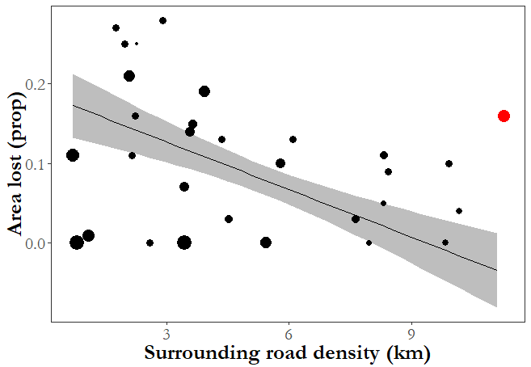
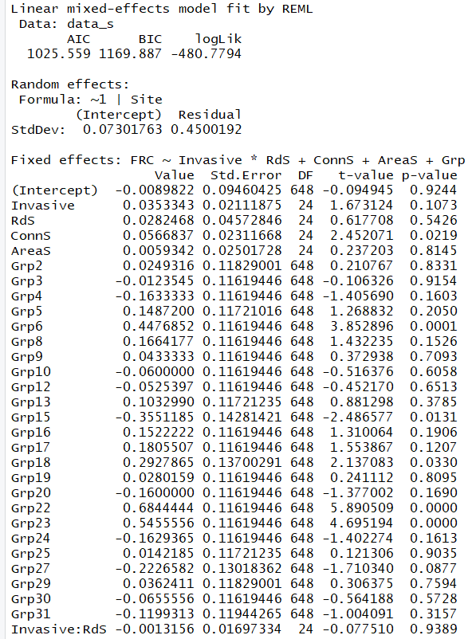

# Garry oak meadow statistical models

## *Conservation Science and Practice,* in press

NAS 05-08-2019

### Script description --

This code creates models and model plots for all statisics in listed publication. For most response variables (area lost, changes in native species richness, and changes in response diversity), models are site-level and fit as simple linear models. For species turnover within a site (0-1 value), the model fit is a generalized linear model with a Gamma distribution. For group-level changes in functional redundancy, the model is mixed effects, with site as a random categorical effect. Code is also given for calculating marginal and conditional r<sup>2</sup> values for the mixed effects model. Data was collected in the spring and summer of both 2007 and 2017, by Dr. Joseph Bennett (2007) and by Dr. Nancy Shackelford (2017) on Saanich Penninsula  in British Columbia. See repository README (currently in prep) and publication (currently in revision) for further details.

### Load packages and prepare data
```
library(MASS)
library(gridExtra)
library(tidyverse)
library(nlme)
library(lme4)
library(arm)
library(extrafont)

### Data file and cleaning
## Data for site-level results
data <- read.csv("Site_data.csv")
colnames(data)[1] <- "Site"
data <- data %>%
  mutate(AreaS = (Area_07 - mean(Area_07)) / sd(Area_07))
rownames(data) <- data$Site

## Data for group-level results (used in functional redundancy only)
data_s <- read.csv('Group_data.csv')
data_s[is.na(data_s)] <- 0
data_s$Invasive <- factor(data_s$Invasive, 
                          levels = c("None", "Low", "Med", "High"))
data_s$Invasive <- as.numeric(data_s$Invasive)
data_s$Grp <- as.factor(data_s$Grp)
data_s <- data_s %>%
  filter(FR.07 > 0) %>%
  mutate(FRC = (FR.17 - FR.07) / FR.07) %>%
  mutate(AreaS = (Area.2007 - mean(Area.2007)) / sd(Area.2007),
         ConnS = (Conn - mean(Conn)) / sd(Conn),
         RdS = (RdDens.1KM - mean(RdDens.1KM)) / sd(RdDens.1KM))
```

### Statistical models and plots
```
## Area lost
ac1 <- lm(AreaC ~ Inv_C * RdS + AreaS, 
          data = data[-which(data$Site == "Summit Park"), ]) # Exclude outlier
summary(ac1)
```


```
## Plot
summit <- which(data$Site == "Summit Park")
rds <- seq(min(data$RdS), max(data$RdS), 0.1)
Area <- data.frame(RdS = rds,
                   Inv_C = rep(2.13, length(rds)),
                   AreaS = rep(0, length(rds)))
Area <- Area %>%
  mutate(AL = predict(ac1, newdata = Area),
         SD = predict(ac1, newdata = Area, se = TRUE)$se.fit) %>%
  mutate(Roads = (RdS * sd(data$RdDens.1KM)) + mean(data$RdDens.1KM))

ggplot(data = data) +
  geom_ribbon(data = Area, aes(x = Roads, ymin = AL-SD, ymax = AL+SD), 
              fill = "grey") +
  geom_line(data = Area, aes(x = Roads, y = AL)) +
  geom_point(aes(x = RdDens.1KM, y = AreaC, size = AreaS),
             color = c(rep("black", (summit-1)), 
                       "red", 
                       rep("black", (nrow(data)-summit)))) +
  labs(y = "Area lost (prop)", 
       x = "Surrounding road density (km)") +
  theme_bw() +
  theme(axis.text.y = element_text(size = 20),
        axis.title.y = element_text(size = 20)) +
  theme(axis.text.x = element_text(size = 20),
        axis.title.x = element_text(size = 20)) +
  theme(panel.grid.major = element_blank(), 
        panel.grid.minor = element_blank(), 
        panel.background = element_blank()) +
  theme(legend.position = "none")
```



```
### Native species
sp2 <- lm(NatC ~ Inv_C * RdS + ConnS + AreaS, 
          data = data)
summary(sp2)
```


```
### Turnover
t1 <- glm(Turnover ~ Inv_C * RdS + ConnS + AreaS, data = data, family = Gamma) 
summary(t1)
```


```
### Response diversity
rd1 <- lm(RDC ~ Inv_C * RdS + ConnS + AreaS, data = data)
summary(rd1)
```


```
### Functional redundancy
fr1 <- lme(FRC ~ Invasive * RdS + ConnS + AreaS + Grp, 
           random = ~1|Site, data = data_s)
summary(fr1)
```



```
## Calculating approximate goodness of fit
# Specify the full model
full <- lmer(FRC ~ Invasive * RdS + ConnS + AreaS + Grp + (1|Site), data = data_s)

# Calculate the fitted values
VarF <- var(as.vector(fixef(full) %*% t(getME(full,"X"))))

# Calculate the marginal r2
# VarCorr() extracts variance components
# attr(VarCorr(lmer.model),'sc')^2 extracts the residual variance
margR2 <- VarF/(VarF + VarCorr(full)$Site[1] + attr(VarCorr(full), "sc")^2)
margR2
```
[1] 0.212477

```
# Calculate the conditional r2
condR2 <- (VarF + VarCorr(full)$Site[1])/(VarF + VarCorr(full)$Site[1] + attr(VarCorr(full), "sc")^2)
condR2
```
[1] 0.2326779

```
## Plot
grp_means <- data_s %>% 
  group_by(Site) %>% 
  summarize(Average = mean(FRC),
            SD = sd(FRC))
colnames(grp_means)[colnames(grp_means) == "Site"] <- "Code"
grp_means$Code <- as.character(grp_means$Code)
grp_means$Code[grp_means$Code == "SEYMOUR-S"] <- "SEYMOUR"

new_d <- data %>%
  dplyr::select(Code, ConnS) %>%
  left_join(grp_means) %>%
  mutate(min_y = Average - SD,
         max_y = Average + SD)

conns <- seq(min(data$ConnS), max(data$ConnS), 0.1)
fr_ch <- data.frame(ConnS = conns,
                    Invasive = rep(2.13, length(conns)),
                    RdS = rep(0, length(conns)),
                    AreaS = rep(0, length(conns)),
                    Grp = rep(unique(data_s$Grp)[10], length(conns)))
fr_ch <- fr_ch %>%
  mutate(FR = predict(fr1, newdata = fr_ch, level = 0),
         FRSD = predictSE.lme(fr1, newdata = fr_ch, level = 0, 
                              se.fit = TRUE)$se.fit) %>%
  mutate(Connectivity = (ConnS * sd(data$Conn)) + mean(data$Conn))
new_d <- new_d %>%
  mutate(Connectivity = (ConnS * sd(data$Conn)) + mean(data$Conn))


ggplot(data = new_d) +
  geom_ribbon(data = fr_ch, aes(x = Connectivity, ymin = FR - FRSD, ymax = FR + FRSD), 
              fill = "grey") +
  geom_line(data = fr_ch, aes(x = Connectivity, y = FR)) +
  geom_errorbar(aes(x = Connectivity, ymin = min_y, ymax = max_y), 
                color = "darkslategray4", width = 0.1) +
  geom_point(aes(x = Connectivity, y = Average), size = 2) +
  labs(x = "Connectivity",
       y = "Change in functional redundancy") +
  theme_bw() +
  #scale_y_continuous(breaks = seq(0.25, 0.65, by = 0.05)) +
  theme(axis.text.y = element_text(size = 16, family = "Garamond"),
        axis.title.y = element_text(size = 20, family = "Garamond",
                                    face = "bold")) +
  theme(axis.text.x = element_text(size = 16, family = "Garamond"),
        axis.title.x = element_text(size = 20, family = "Garamond",
                                    face = "bold")) +
  theme(panel.grid.major = element_blank(), 
        panel.grid.minor = element_blank(), 
        panel.background = element_blank()) +
  theme(legend.position = "none")
```

